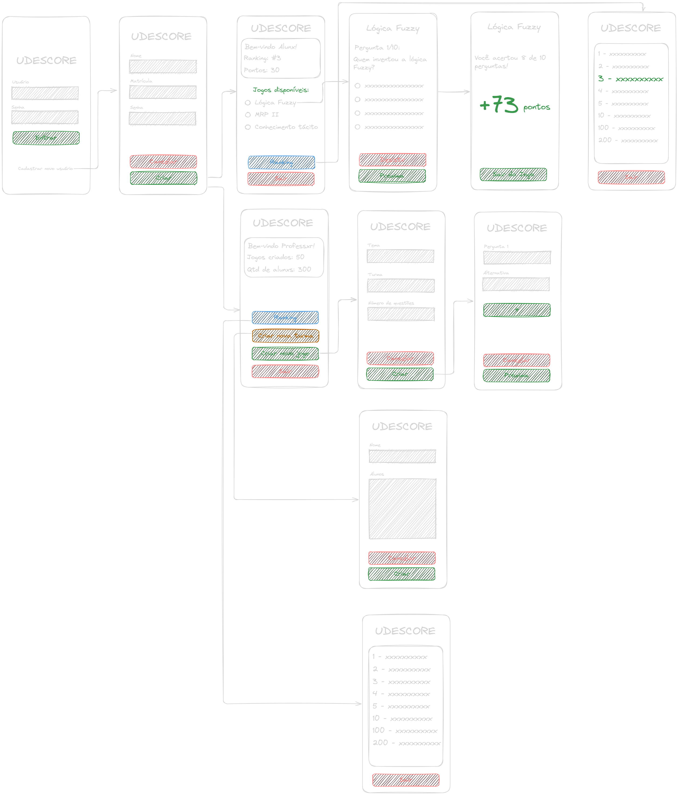

# udescore

## Objetivo

Desenvolver um aplicativo que utiliza um sistema de ranks (estilo de jogos) baseado nas notas dos alunos, para encorajar o estudo de forma gamificada.

## Design

O protótipo visual do aplicativo foi desenvolvido no Canva.  
[Acesse o design aqui](https://www.canva.com/design/DAGm_6mePuE/k-8DEvxPT5-YhxS9P-cCpQ/edit?utm_content=DAGm_6mePuE&utm_campaign=designshare&utm_medium=link2&utm_source=sharebutton) para visualizar a interface e a identidade visual do projeto.

## Tecnologias

- **Frontend (App)**: React Native
  - Aplicativo focado em realizar chamadas ao backend, com pouco processamento interno.
- **Backend**: PHP
  - Responsável pelo processamento dos dados e rotas para fornecer as notas dos alunos.
- **Banco de Dados/Servidor**:
  - Hospedagem do servidor e banco de dados na Hostinger.

## Como Dsenvolver

Clique [aqui](/backend/README.md) para aprender como desenvolver o **BACKEND**.

Clique [aqui](/frontend/README.md) para aprender como desenvolver o **FRONTEND**.

## Divisão de Tarefas

### Design e Protótipo

- Gianne
- Fernando

### Desenvolvimento do App (Criação de Telas)

- Vitor (casado)
- Tiago Merib (Rock N Roll)

### Desenvolvimento do App (Chamadas e Processamento Básico)

- Pasini
- Arthur

### Backend

- Streit
- Arthur
- Freddy
- Thomas
- Jeferson

### Banco de Dados

- Freddy

> Obs: Estas divisões de tarefas podem mudar conforme o andamento do projeto.

### Wireframe

## Progresso

- Para iniciar:

- [x] Criar wireframe extremamente básico para início da programação (Fernando e Gianne)
- [ ] Criação do banco de dados baseado nas telas
